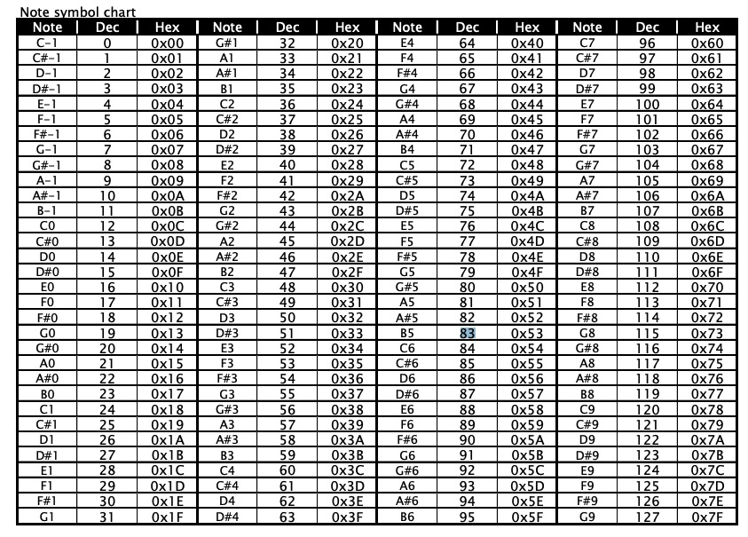

# Over Engineered Smoke on the Water
This is a project to study Go and music theory

## How to run
On root directory run:
```
go run main.go
```

## Resources
Notes codes



## References

- http://www.cs.uccs.edu/~cs525/midi/midi.html
- http://www.music-software-development.com/midi-tutorial.html
- https://www.pioneerdj.com/-/media/pioneerdj/software-info/controller/ddj-wego3/ddj-wego3_list_of_midi_message_e.pdf
